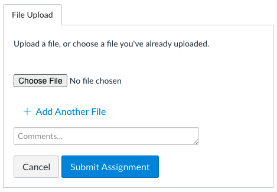

# Introductory Command Line Lab

It's time for you to practice navigating around the command line.

## Instructions

### Downloading this Lab

1. On this page, click the green "Code" button up above. Then, click "Download ZIP". This should download the `.zip` file to your `Downloads/` folder.

1. Unzip the downloaded file. This can be done by double clicking on the folder that was downloaded to your `Downloads/` folder. It will create a folder of the same name in your Downloads folder.

1. Navigate to the folder and open it with VSCode. Then, follow the instructions below.

### Completing this Lab

For each of the tasks below, you will need to follow the steps exactly. Then, you'll use the `history` command as described below to get a print out of the last commands you ran. Each line printed out should match one of the instructions. If it didn't work exactly right, practice again!

Copy the output from the `history` command into the `my-solution.md` file in the appropriate location.

If you are asked to create any directories or files in the tasks below, you may delete them _after you have submitted this lab._

### Submitting the Lab

To submit the Lab on Canvas, you will need to upload the file from your computer to Canvas. After clicking the "Start Assignment" button, you should see a place to upload a file.



You only need to upload the `my-solution.md` file. You should not need to upload any other files.

Reach out to an instructor if you need help.

## Tasks

### Task 1

Complete the steps below as described.

1. Navigate to your home directory.

1. Create a new directory called `introductory-command-line-lab/`.

1. Navigate inside of that directory.

1. Create a file called `commands.txt`.

1. Open the entire `introductory-command-line-lab/` directory in Finder from the command line.

1. Navigate back to your home directory, using a relative file path.

Once you are done, type the following command:

```
history | tail -n 10
```

### Task 2

Complete the steps below as described.

1. Navigate to your home directory.

1. Create a new folder called `module-one/` from your home directory.

1. From your home directory, create a new folder _inside_ of the `module-one/` folder called `introductory-javascript/`.

1. From your home directory, create a new folder _inside_ of the `introductory-javascript/` folder called `variables/`.

1. From your home directory, create three new files at once _inside_ of the `variables/` folder called: `var.txt`, `let.txt`, and `const.txt`.

1. From your home directory, open up with VSCode the `variables/` folder using a relative path.

Once you are done, type the following command:

```
history | tail -n 10
```
